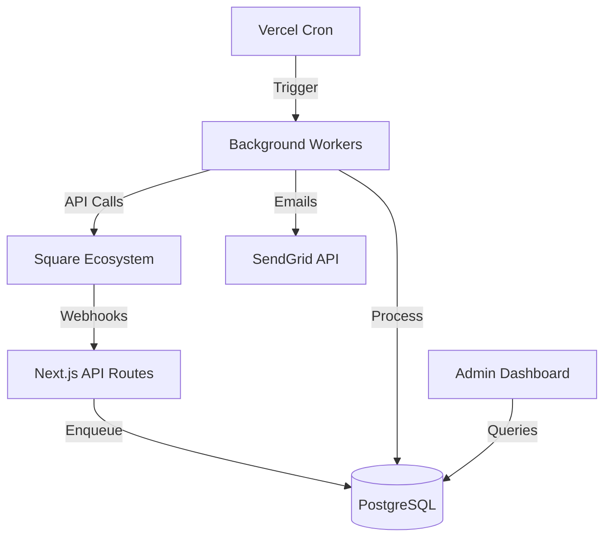

# Referral & Analytics System

Production-grade management system for salon analytics, master earnings, and customer referrals, integrated with Square.

## 🏗 Architecture Overview

The system is built as a Next.js application using Prisma ORM and PostgreSQL. It functions as a middleware between Square's ecosystem and internal business logic.

### 🔌 Database Connectivity & Scaling
The system is optimized for **Supabase** and high-concurrency serverless environments:
- **Connection Pooling**: Uses Supabase's built-in connection pooling via `pgbouncer` parameters in the `DATABASE_URL`.
- **Connection Limits**: Configured to minimize active connections to prevent "Max Connections Reached" errors.
- **Log Retention**: Automatically deletes logs older than 30 days via a daily cron job (`/api/cron/cleanup-logs`).



### Core Domains
1. **Referral System**: Manages friend-to-friend invites, automated $10 gift card issuance, and anti-abuse (self-referral) logic.
2. **Master Earnings**: Calculates technician commissions and tips based on booking snapshots and completed payments.
3. **Analytics**: Aggregates daily performance metrics for administrators and technicians.

---

## 🚀 Getting Started

### Environment Variables
The system requires several critical environment variables. See `lib/config/env-validator.js` for the full list.

| Variable | Purpose |
| :--- | :--- |
| `DATABASE_URL` | Primary PostgreSQL connection string. |
| `SQUARE_ACCESS_TOKEN` | Production Square API token. |
| `SQUARE_LOCATION_ID` | Default location for gift card issuance. |
| `SENDGRID_API_KEY` | For automated reward emails. |
| `CRON_SECRET` | Secures cron endpoints from unauthorized triggers. |

### Installation
```bash
npm install
npx prisma generate
```

---

## 📂 Documentation Map

Detailed guides are located in the `/docs` folder:

1. [**Referral Logic**](docs/REFERRALS.md): How invites work, reward triggers, and the "Carry-Forward" recovery system.
2. [**Analytics & Earnings**](docs/ANALYTICS.md): Calculation logic for Master earnings and daily KPIs.
3. [**Webhook Architecture**](docs/WEBHOOKS.md): Handling Square events reliably with idempotency.
4. [**Cron & Background Jobs**](docs/CRON_JOBS.md): Queue management and worker retry logic.
5. [**Debugging Guide**](docs/DEBUGGING.md): How to use `application_logs` and trace specific events.
6. [**Data Repair & Backfills**](docs/DATA_REPAIR.md): Safe scripts for correcting historical data.
7. [**Scaling Roadmap**](docs/SCALING_ROADMAP.md): Strategy for multi-tenant automation and OAuth 2.0.
8. [**Security & Privacy**](docs/SECURITY.md): Data handling policies and anti-abuse mechanisms.
9. [**Database Schema**](docs/DATABASE_SCHEMA.md): Comprehensive reference for all system tables.

---

## 🛠 Operational Truths

### Data Movement
- **Square -> DB**: Webhooks are the primary source of truth for Bookings, Payments, and Customers.
- **DB -> Square**: The system issues Gift Cards and updates Custom Attributes via the Square SDK.
- **Async Processing**: Most logic (like issuing rewards) happens in background workers triggered by cron, not inside the webhook handler itself.

### Critical Invariants
- **No Self-Referrals**: A customer cannot be rewarded for using their own referral code.
- **Idempotency**: Every referral event has a `correlationId`. The system will never issue a reward twice for the same event.
- **Snapshot Integrity**: Master earnings are calculated from `BookingSnapshot` records to ensure commissions remain stable even if service prices change later.

---

## 🆘 Troubleshooting

| Issue | Common Cause | Fix |
| :--- | :--- | :--- |
| Missing Referral Reward | 401 API Error during check | Check `application_logs` for `self_referral` blocks or API errors. |
| Duplicate Emails | Database transaction failed | Ensure `organization_id` is correctly resolved in the log entry. |
| Analytics Out of Date | Cron job failed | Manually trigger `/api/cron/refresh-customer-analytics`. |

### SQL Diagnostic: Check Recent Errors
```sql
SELECT log_type, status, payload->>'message' as error, created_at 
FROM application_logs 
WHERE status = 'error' 
ORDER BY created_at DESC LIMIT 10;
```
