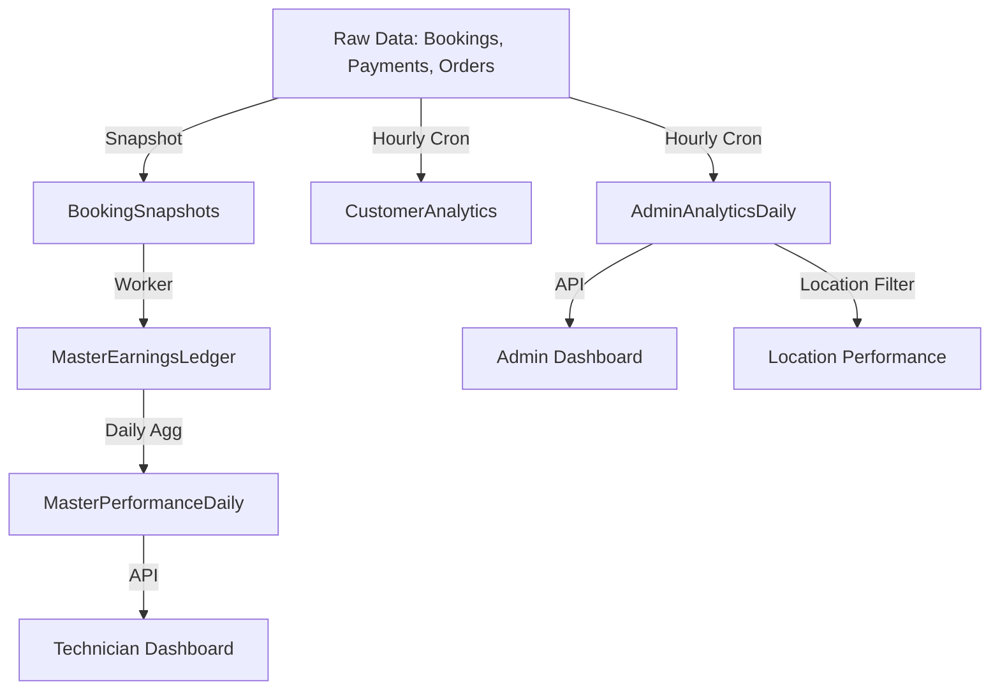

# Analytics & Performance Documentation

This document provides a comprehensive guide to the analytics modules, including Admin, Master (Technician), and Location performance tracking.

## 🏗 Analytics Architecture

The system uses a tiered aggregation model to provide fast, reliable metrics for dashboards while maintaining a full audit trail.



---

## 1. Admin Analytics (`AdminAnalyticsDaily`)

**Purpose**: Provides salon owners with a daily view of operational performance.
**Table**: `admin_analytics_daily`
**Refresh Job**: `/api/cron/refresh-admin-analytics`

### Key Metrics & Logic
- **Timezone Handling**: All metrics are normalized to `America/Los_Angeles` (Pacific Time) regardless of Square's UTC timestamps.
- **Booking Productivity**: 
    - `bookings_created_count`: Counted by the date the booking was **made** (created_at). This reflects the admin's workload on that specific day.
- **Service Performance**:
    - `appointments_total`: Counted by the date the service was **scheduled** (start_at).
    - `appointments_accepted`: Count of services successfully completed.
    - `late_cancellations`: Cancelled within 24 hours of the `start_at` time.
- **Financials**:
    - `creator_revenue_cents`: Revenue attributed to the person who **booked** the appointment.
    - `cashier_revenue_cents`: Revenue attributed to the person who **checked out** the customer.
    - `cashier_tips_cents`: Total tips collected by that staff member.

---

## 2. Master Analytics (`MasterPerformanceDaily`)

**Purpose**: Tracks individual technician (Master) performance, income, and utilization.
**Table**: `master_performance_daily`
**Refresh Job**: `scripts/refresh-master-performance.js` (Triggered hourly)

### Key Metrics & Logic
- **Income Tracking**:
    - `net_master_income`: Total commission earned from the `MasterEarningsLedger`.
    - `tips_total`: Total tips attributed to the master from completed payments.
- **Operational Efficiency**:
    - `booked_minutes`: Total duration of all `ACCEPTED` bookings for the day.
    - `utilization_rate`: `booked_minutes / available_minutes`. (Note: `available_minutes` is currently derived from staff working hours).
    - `composite_score`: A weighted score (0-100) based on revenue, utilization, and customer retention.

---

## 3. Location Performance Analytics

**Purpose**: Comparative analysis between different salon branches.
**Source**: Filtered views of `AdminAnalyticsDaily` and `analytics_revenue_by_location_daily`.

### Logic
- **Location Isolation**: Every record in the analytics tables is keyed by `location_id` (UUID) and `organization_id`.
- **Revenue Attribution**: Revenue is linked to the location where the **payment was processed**, not necessarily where the customer was created.
- **Cross-Location Clients**: If a customer visits Location A and then Location B, they are counted as a "Returning Client" for the organization, but a "New Client" for Location B if it's their first time there.

---

## 👤 Customer Segmentation & Lifecycle

**Table**: `customer_analytics`
**Refresh Job**: `/api/cron/refresh-customer-analytics`

### Segmentation Logic
The system automatically classifies customers every hour:
- **NEW**: First-ever visit was within the last 30 days.
- **ACTIVE**: Has visited within the last 30 days.
- **AT_RISK**: No visits in 30–90 days.
- **LOST**: No visits in over 90 days.
- **POTENTIAL**: Profile exists (e.g., from a walk-in inquiry) but no successful bookings recorded.

---

## 🆘 Troubleshooting Analytics

### Data Discrepancies
If the dashboard doesn't match Square:
1.  **Check Sync Status**: Ensure the `bookings` and `payments` tables are up to date.
2.  **Manual Refresh**: You can force a refresh for a specific date range by calling the cron endpoint with parameters:
    `GET /api/cron/refresh-admin-analytics?from=2026-02-01&to=2026-02-28`
3.  **Check Unattributed Revenue**: Look for records where `team_member_id` matches the **System User** (used when Square doesn't provide a staff ID).

### SQL: Check Location Revenue Comparison
```sql
SELECT 
    l.name, 
    SUM(r.revenue_dollars) as total_revenue,
    COUNT(DISTINCT r.date) as days_active
FROM analytics_revenue_by_location_daily r
JOIN locations l ON r.location_id = l.id
WHERE r.date >= '2026-03-01'
GROUP BY l.name;
```
