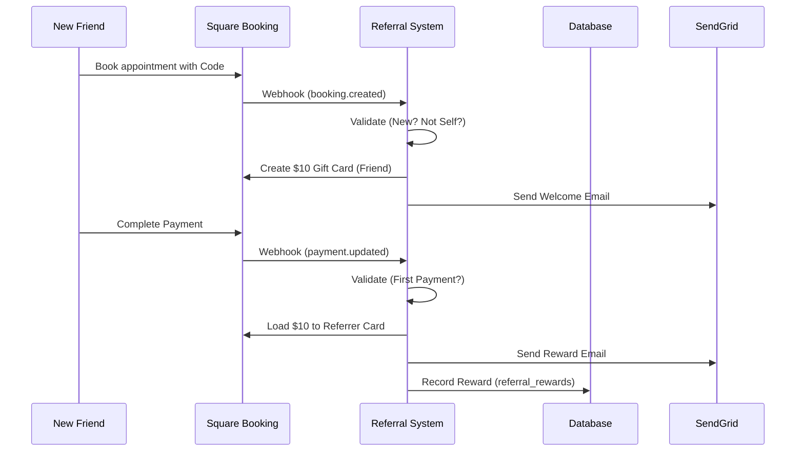

# Referral System Logic

The referral system automates the acquisition of new clients by rewarding both the referrer and the new friend with $10 gift cards.

## 🔄 The Referral Lifecycle

## 🛡 Anti-Abuse Logic (Self-Referral Prevention)

The system enforces a strict "No Self-Referral" policy. A referral is blocked if:
1.  **Identity Match**: The `customerId` of the person booking matches the `referrerId` who owns the code.
2.  **Code Match**: The code used starts with the customer's own first name (e.g., `NAME1234` used by a customer named `Name`).
3.  **Existing Client**: The customer has a booking history prior to using the code.

### Implementation Details
- **Webhook Check**: Performed in `app/api/webhooks/square/referrals/route.js`.
- **Worker Check**: Final mandatory check in `lib/webhooks/giftcard-processors.js` before Square API calls.

## 💰 Reward Fulfillment

### 1. Friend Signup Bonus ($10)
- **Trigger**: `booking.created` or `booking.updated` (status: ACCEPTED).
- **Condition**: Must be the customer's first-ever booking.
- **Action**: A new DIGITAL gift card is created in Square.

### 2. Referrer Reward ($10)
- **Trigger**: `payment.updated` (status: COMPLETED).
- **Condition**: Must be the referred friend's first-ever payment.
- **Action**: 
    - If Referrer has no card: Create new card.
    - If Referrer has a card: Add $10 to the existing card balance.

## 🔄 Carry-Forward Recovery System

For historical accidental rewards (self-referrals), the system uses a "Carry-Forward" state machine.

- **RESERVED**: The customer has an accidental $10 balance.
- **CONSUMED**: When they make a **legitimate** referral, the system "consumes" the old $10 instead of paying out a new reward.
- **Table**: `referral_carry_forward`

## 📊 Source of Truth
- **Square**: Owner of the Gift Card balance and the "Referral Code" custom attribute.
- **Database (`referral_rewards`)**: Owner of the "Legitimacy" status. If it's not in this table, it's not a valid referral.

## 🆘 Common Failure Modes
| Failure | Cause | Recovery |
| :--- | :--- | :--- |
| **401 Unauthorized** | Square Token expired or invalid | Update `SQUARE_ACCESS_TOKEN` in `.env`. |
| **Duplicate Rewards** | Database save failed after email sent | Check `application_logs` for `organization_id` resolution errors. |
| **Missing Code** | Square Custom Attribute sync delay | Run `scripts/deep_referral_research.js` to recover hidden codes. |

